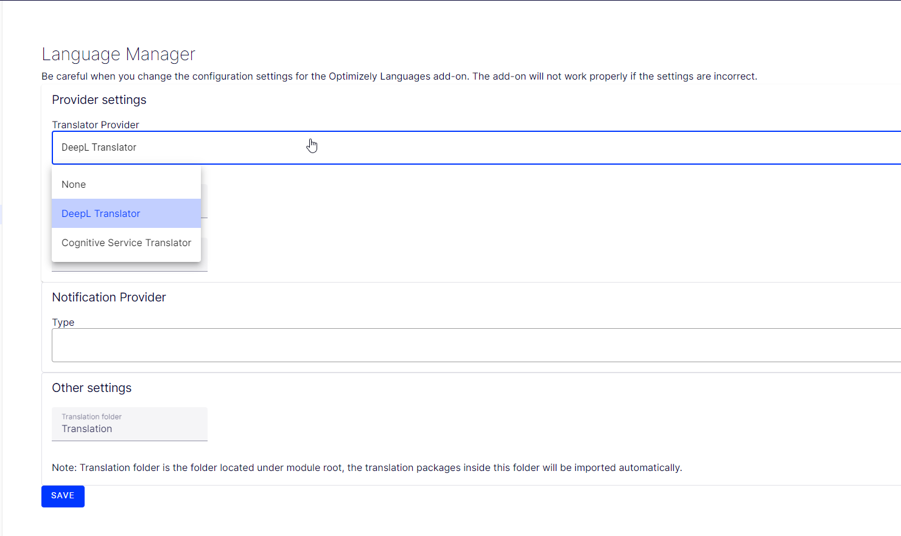

# Optimizely DeepL Translation README

## Overview
Welcome to the Optimizely DeepL Translation tool! This tool allows you to integrate powerful machine translation capabilities into your applications using the DeepL API, optimized for various use cases.

## Getting Started

Follow these steps to quickly get started with Optimizely DeepL Translation:

 1. **Sign Up for DeepL API Key:**
		 Visit [DeepL API](https://www.deepl.com/en/docs-api) and sign up for an API key.
 2. **Integrate DeepL API Key:**
	 Insert your DeepL API key into the configuration file or directly into your app settings or startup.cs file.
     
     AppSettings.json
     ```json
	 "DeepL": { 
        "SentenceSplittingMode": 1,
        "PreserveFormatting": false, 
        "Formality": "less",
        "GlossaryId": "(Replace with your glossary)", 
        "TagHandling": "html", 
        "OutlineDetection": false, 
        "AuthorizationKey": "(Your authorization Key)"
    }
    ```
 3. **Usage Example:**
	 Explore the example code provided in the repository to understand how to implement translation in your application.
     
	Startup.cs
     ```csharp
	service.AddDeepLLanguageService()
    ```
 4. **Language manager settings**
    Make sure you select DeepL Translation in the dropdown for language settings 
    